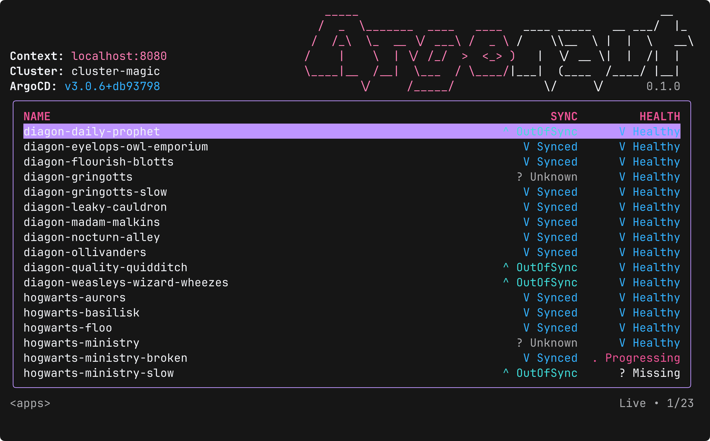
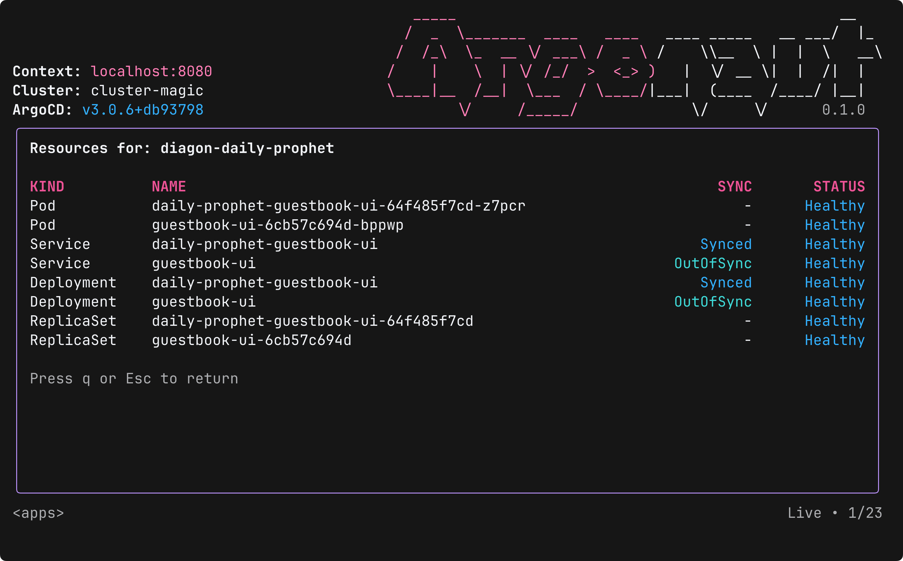
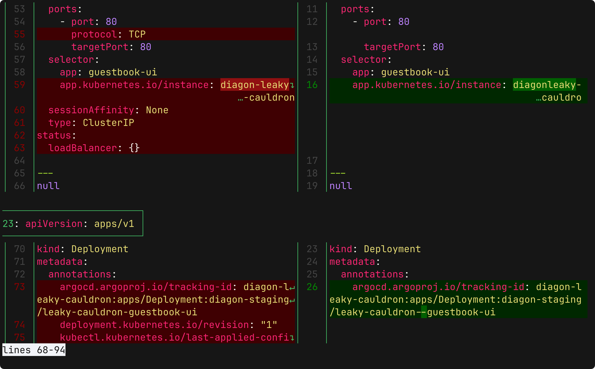
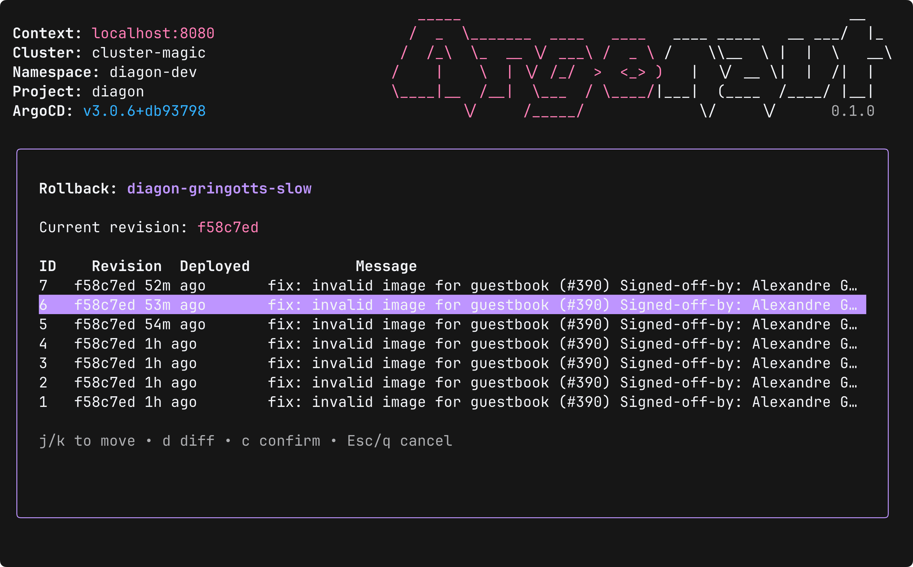

# 🐙 Argonaut — Argo CD TUI

[](https://www.npmjs.com/package/argonaut-cli)
[](https://github.com/darksworm/argonaut/releases/latest)
[](https://github.com/darksworm/argonaut/blob/main/LICENSE)
[](https://codecov.io/github/darksworm/argonaut)

Argonaut is a keyboard-first terminal UI for **Argo CD**, built with **React + Ink**. Browse apps, scope by clusters/namespaces/projects, stream live resource status, trigger syncs, inspect diffs in your favorite pager, and roll back safely — all without leaving your terminal.

> ❤️ 🐶
> &nbsp;Inspired by the great UX of [k9s](https://k9scli.io) — but for Argo CD.

---

## 📦 Prerequisites

- [**Argo CD CLI**](https://argo-cd.readthedocs.io/en/stable/cli_installation/) installed
- [**Delta**](https://dandavison.github.io/delta/installation.html) installed for enhanced diffs (optional, falls back to `git`)

---

## 🚀 Installation methods

<details>
  <summary><strong>Install Script (Linux/macOS)</strong></summary>

```bash
curl -sSL https://raw.githubusercontent.com/darksworm/argonaut/main/install.sh | sh
```

The install script automatically detects your system (including musl vs glibc on Linux) and downloads the appropriate binary from the latest release.

You can also install a specific version:
```bash
curl -sSL https://raw.githubusercontent.com/darksworm/argonaut/main/install.sh | sh -s -- v1.13.0
```
</details>

<details>
  <summary><strong>npm (Linux/macOS)</strong></summary>

```bash
npm i --global argonaut-cli
```
</details>

<details>
  <summary><strong>Homebrew (Linux/MacOS)</strong></summary>

```bash
brew tap darksworm/homebrew-tap
brew install darksworm/tap/argonaut
```
</details>

<details>
  <summary><strong>AUR (Arch User Repository)</strong></summary>

```bash
yay -S argonaut-bin
```
</details>

[//]: # ()
[//]: # (<details>)

[//]: # (  <summary><strong>NUR &#40;Nix User Repository&#41;</strong></summary>)

[//]: # ()
[//]: # (```bash)

[//]: # (nix-env -iA nur.repos.darksworm.argonaut)

[//]: # (```)

[//]: # (</details>)

<details>
  <summary><strong>Download a binary</strong></summary>

You can download binaries and packages in from the [**latest release**](https://github.com/darksworm/argonaut/releases/latest).

</details>


## ⚡ Quickstart
```bash
# Log in to your Argo CD server
argocd login

# Start Argonaut
argonaut
```

---

## ✨ Highlights

- **Instant app browsing** with live updates (NDJSON streams)
- **Scoped navigation**: clusters → namespaces → projects → apps
- **Command palette** (`:`) for actions: `sync`, `diff`, `rollback`, `resources`, etc.
- **Live resources view** per app with health & sync status
- **External diff integration**: prefers `delta`, falls back to `git --no-index diff | less`
- **Guided rollback** with revision metadata and progress streaming
- **Keyboard-only workflow** with Vim-like navigation

---

## 📸 Screenshots

### **Apps**  


### **Resources**  


### **Diff**  


### **Rollback**  

